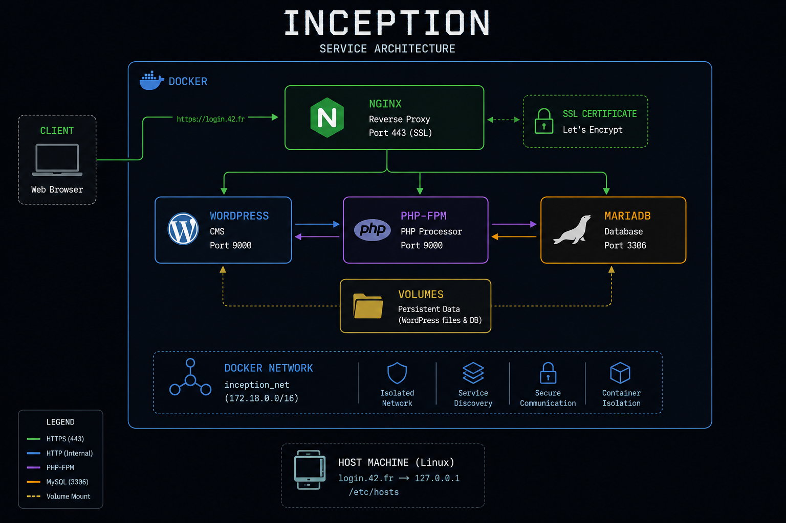

<p align="center">
  
</p>

<p align="center">
  <b>This project has been created as part of the 42 curriculum by tmatheusdiniz</b>
</p>

# Inception

## Description

Inception is a system administration project from the 42 curriculum. The goal is to set up a small but complete web infrastructure using Docker and Docker Compose, running entirely inside a virtual machine. Each service runs in its own dedicated container, built from scratch using custom Dockerfiles based on either Alpine or Debian.

The infrastructure is composed of three core services communicating through a private Docker network:

- **NGINX** — the sole entry point to the infrastructure, serving HTTPS traffic exclusively on port 443 using TLSv1.2 or TLSv1.3
- **WordPress + php-fpm** — the web application, configured and running without NGINX
- **MariaDB** — the relational database used by WordPress

Data is persisted through two Docker volumes — one for the WordPress database and one for the WordPress website files — both stored on the host machine under `/home/login/data`.

The project covers the following concepts:
- **Docker** — images, containers, Dockerfiles, Docker Compose
- **Networking** — custom Docker bridge networks, port exposure, service communication
- **Volumes** — persistent storage for stateful services
- **Security** — TLS configuration, environment variables, secrets management, no credentials in source code
- **System administration** — process management (PID 1), daemon behavior, service restart policies

### Virtual Machines vs Docker

A virtual machine emulates an entire operating system on top of a hypervisor, providing strong isolation but at the cost of significant resource overhead. Each VM requires its own OS kernel, memory allocation, and storage. Docker containers, by contrast, share the host kernel and isolate processes using Linux namespaces and cgroups. They are lightweight, start in seconds, and are designed to run a single service or process. Containers are not VMs — they should not be treated as such.

### Secrets vs Environment Variables

Environment variables are the standard way to pass non-sensitive configuration to containers. They are defined in a `.env` file and injected at runtime via Docker Compose. For sensitive data such as passwords, Docker secrets provide a more secure alternative: secrets are mounted as files inside the container at `/run/secrets/`, are never exposed in environment listings, and are harder to leak accidentally. In this project, non-sensitive settings (domain, database name) live in `.env`, while all credentials are kept as secret files — and credentials must never appear in Dockerfiles or be committed to the repository.

### Docker Network vs Host Network

Using `network: host` removes network isolation entirely — the container shares the host's network stack directly. This is forbidden in this project. Instead, a custom Docker bridge network is defined in `docker-compose.yml`, allowing containers to communicate with each other by service name while remaining isolated from the outside world. The only exposed port is 443 on the NGINX container.

### Docker Volumes vs Bind Mounts

A bind mount links a specific host path directly to a path inside the container, tightly coupling the container to the host's directory layout. Docker volumes are managed by Docker itself and offer a cleaner abstraction for persistent data: they are portable and easier to back up. In this project the two persistent stores keep their data under `/home/login/data` on the host, as required by the subject.

## Instructions

The project must be run on a Linux machine with Docker, Docker Compose, and make installed. Additionally, the domain login.42.fr must point to the VM by adding an entry to /etc/hosts.

The Makefile automates the setup process; however, you must have permission to use sudo and execute the required commands.

From the directory containing the `Makefile`, build and start the whole stack with:

```bash
git clone git@github.com:tmatheusdiniz/Inception.git && cd Inception
make
```

The WordPress site is then available at `https://login.42.fr`.

## Project Structure

```zshell

.
├── Makefile
├── secrets/
│   ├── credentials.txt
│   ├── db_password.txt
│   ├── db_root_password.txt
|   └── ...
└── srcs/
|    ├── docker-compose.yml
|    ├── .env
|    └── requirements/
|        ├── nginx/
│           ├── Dockerfile
│           ├── conf/
│           └── tools/
|        ├── wordpress/
│           ├── Dockerfile
│           ├── conf/
│           └── tools/
|        └── mariadb/
|            ├── Dockerfile
|            ├── conf/
|            └── tools/
```

## Resources

### Documentation
- [Docker official documentation](https://docs.docker.com/)
- [Docker Compose reference](https://docs.docker.com/compose/)
- [Docker secrets](https://docs.docker.com/engine/swarm/secrets/)
- [NGINX documentation](https://nginx.org/en/docs/)
- [TLS/SSL with NGINX](https://nginx.org/en/docs/http/configuring_https_servers.html)
- [MariaDB documentation](https://mariadb.com/kb/en/)
- [WP-CLI documentation](https://wp-cli.org/)
- [php-fpm configuration](https://www.php.net/manual/en/install.fpm.configuration.php)
- [PID 1 and signal handling in containers](https://cloud.google.com/architecture/best-practices-for-building-containers#signal-handling)
